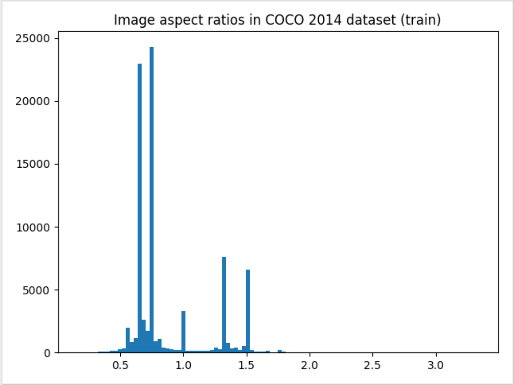

# Codebase Details

For training, the codebase is broken into a few major parts:

- `train.py` handles parsing the command line arguments, loading the model, and configuring and launching the training.
- `config.py` holds various configurations needed by the model. 
- `dataset.py` handles a lot of COCO specific logic such as parsing annotations and computing evaluation metrics from a set of predictions.
- `common.py`, `model_box.py`, `performance.py`, `viz.py` and `utils/` hold various utilities, mostly for either debugging or manipulating bounding boxes, anchors and segmentation masks.

The core model has two components - the Tensorflow graph and the non-Tensorflow data pipelines implemented using Tensorpack DataFlows and numpy.

- Code for the Tensorflow graph is in `model/`. 
    - `model/generalized_rcnn.py` has a `DetectionModel` class whose `build_graph()` method outlines a generic two stage detector model.
    - `ResNetFPNModel` subclasses that and provides implementations of the backbone, rpn and roi_heads. `ResNetFPNModel.inputs()` uses tf.placeholders to define the input it expects from the dataflow
- `data.py` holds the data pipeline logic. The key function for training is `get_batch_train_dataflow()`, which contains logic for reading data from disk and batching datapoints together.

## Batchification

We added the ability have a per-GPU batch size greater than 1. Below are some implementation details of what that means.

- In the data pipeline, we took the existing outputs (image, gt_label, gt_boxes, gt_masks) and added a batch dimension, padding when different images have different shapes. To account for this padding in the model, we added two new inputs, `orig_image_dims` and `orig_gt_counts` which are used to slice away padding when necessary.
- Most of the core convolutional and fully connected layers used tf.Layers which already supports a batch dimension, so we didn't need to make substantial changes there. We did add FP16 support for most layers that use matrix multiplications, so take advantage of NVIDIA's tensor cores.
- In some cases, such as calculating losses, batchification meant looping over each image in the per-GPU batch, calculating the loss for a single image and then averaging the losses over the per-GPU batch.
    - This may be an area to improve performance in the future, but we are unsure how impactful optimizing that code would be as the operations where we do this seem to be fairly computationally lightweight.
    
    
### Predefined Padding

Predefined padding is a throughput optimization. **If your input images are already constant size, you do not need predefined_padding**.

Cudnn autotuning is an NVIDIA runtime optimization where, given a tensor and an operation, cudnn tries to find the most efficient way to execute it by trying a different approach the first N times that the tensor + operation is called for all future tensor + operation. After the Nth execution, the best approach found so far is used. This manifests as throughput that increases over time until a steady state throughput is reached. 

The best execution is dependent on the shape of the tensor, so the more different shapes you use, the longer it takes to reach the steady state throughput. Additionally, the duration of a single step (forward pass + backwards pass) is based on the duration of the step for the slowest GPU. this means that while one GPU might encounter a tensor + op that it knows a fast execution for, if another GPU is encountering a new tensor+op combination, the step will be slow. The impact of this is that as you increase the number of GPUs, it takes a longer and longer time for the steady state throughput to be reached (on 8 GPUs using COCO, you will see steady state by epoch 3, but for 32 GPUs, it could take 10 epochs).

You can avoid this problem by reducing the number of tensor shapes, which for this codebase means reducing the number of shapes that the input image can take. We added the `predefined padding` optimization, which defines a small number of acceptable shapes and each input image is matched with an acceptable shape based on aspect ration and padded so that the input `image` exactly matches that shape. For COCO, this is a fairly large performance improvement, as we now reach the steady state throughput much faster (3-4 epoch with 32 GPUs).

For COCO, most images fall into a small set of aspect ratios.

### Removed Features

To enable our focus on throughput, we have removed some unused features from the original Tensorpack code:

- We only support FPN-based training
- We do not have support for Cascade RCNN

## Custom TF ops

We have used two custom Tensorflow ops to get improved throughput. This is the main reason you need to use a custom Tensorflow binary (this is also a bug introduced in TF 1.13 that we needed to fix, see `patch/`).

In the RPN, we use `tf.generate_bounding_box_proposals` which is a function that takes in the RPN logits, converts the regression logits into bounding box coordinates and then applies NMS. 

In the ROI heads, we use `tf.roi_align`.

Both of these are implemented here: https://github.com/samikama/tensorflow/commits/GenerateProposalsOp

These ops is being upstreamed to TF (with some minor differences) and we will move this codebase to the native TF ops once we are able.

- ROIAlign PR - https://github.com/tensorflow/tensorflow/pull/28746
- Generate Bounding Box PR - https://github.com/tensorflow/tensorflow/pull/28754

## FP16

We offer mixed precision training, which substantially improves throughput on NVIDIA tensor cores. It is important to note that you need to both pass in the `--fp16` flag to `train.py` AND set the `TENSORPACK_FP16` environmental variable to 1. `--fp16` tells the model to use FP16, while the `TENSORPACK_FP16` envvar enables loss scaling. 

Loss scaling occurs inside of the Tensorpack library, not in the MaskRCNN model code, which is why you need to set both. This should probably be addressed in the future.

## Tensorpack changes since fork we may want to port

- Port TensorSpec changes, replacing tf.placeholder
- Change to L1 loss? - https://github.com/tensorpack/tensorpack/commit/d263818b8fe8d8e096c4826dc5f2432901c5a894#diff-75814de28422d125213d581d1a36d92a
- Improved accuracy via better anchor generation - https://github.com/tensorpack/tensorpack/commit/141ab53cc37dce728802803747584fc0fb82863b
- Faster COCO loading - https://github.com/tensorpack/tensorpack/commit/8c8de86c46cadebb1860feae832347e423f5942b
